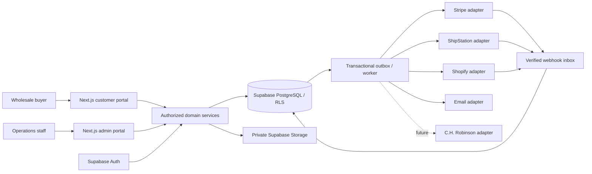

# Horizon Vert Foods — product and architecture blueprint

Status: proposed design for approval; no application or live integration implemented.
Updated: September 17, 2026.

## Product direction

Build a US-first wholesale ordering platform for Horizon Vert Foods. Use USD at launch. Buyers purchase through company accounts approved by the operations team. Stripe handles credit card and US ACH Direct Debit payments, subject to the merchant account's eligibility. Existing Shopify retail commerce remains in place.

The product combines Uline-style purchasing efficiency with a modern, restrained visual language and Shopify-style administration. The primary success measure is how quickly an approved buyer can accurately place a repeat order. Admin success means handling applications, catalog maintenance, pricing and fulfillment without developer assistance.

This blueprint supplements `idea.md`. Its payment decisions supersede that document's original manual-payment-first checkout. The accompanying `schema.sql` is a proposed complete relational design, not an applied migration. Phase 1 will turn the approved subset into versioned Supabase migrations and tested policies.

## 1. System architecture

Use a modular monolith: one Next.js application, one Supabase PostgreSQL database, and a separately scheduled background worker. Split domains by ownership and typed service contracts. This keeps transactional commerce operations practical while allowing shipping, payments and synchronization to evolve independently.



Next.js uses App Router and TypeScript; Tailwind and selected shadcn primitives provide the UI; Zod validates inputs; React Hook Form supports complex forms. Supabase provides Auth, PostgreSQL and private document storage. Provider SDKs and credentials remain server-only. Hosting selection remains open until runtime and worker needs are verified; the product specification does not depend on a particular deployment vendor.

### Module contracts

| Module | Owns | Public operations |
| --- | --- | --- |
| Identity | Verified sessions, staff roles, company memberships | requireUser, requirePermission, resolveCompany |
| Accounts | Applications, company setup, invitations, addresses | apply, reviewApplication, acceptInvitation |
| Catalog | Products, categories, packaging, availability projection | searchCatalog, getProduct, updatePackaging |
| Pricing | Price lists, tiers, breaks, company overrides | resolvePrice, quoteCart |
| Cart | Company/location drafts, quantities | addItem, updateItem, revalidate |
| Orders | Order snapshots and allowed state transitions | submitOrder, cancelOrder, reorder |
| Payments | Attempts, provider references, refunds, disputes | createPayment, reconcilePayment, refundPayment |
| Shipping | Quote rules, packages, shipments, tracking | quoteShipment, purchaseLabel, trackShipment |
| Integrations | Sync jobs, inbox, outbox, provider adapters | importCatalog, handleWebhook, retryOperation |
| Administration | Settings, audit trails, operational views | updateSettings, reviewAudit |
| Notifications | Templates and delivery attempts | enqueueNotification |

UI routes call services; services call repositories and adapters. One domain cannot write another domain's tables directly. Shared primitives cover money, quantity, identity, clock, validation and errors—not a catch-all business-logic folder. Server actions and route handlers are transport adapters, not the home of pricing or fulfillment rules.

## 2. Account setup and company model

Application → review → approval → verified account activation → company setup → purchasing.

1. The public application collects the fields in `idea.md`, with US state/ZIP inputs and business type. An applicant supplies business information without creating an active wholesale customer. Rate limits, bot mitigation and generic acknowledgments protect the endpoint. Submission does not grant catalog or pricing access.
2. Staff review duplicates by normalized email, legal name and business identifier. Similarity is a review signal, not automatic merging. Applications may be rejected with an internal reason and a separately written customer message.
3. Approval transaction creates or explicitly links a company, assigns a pricing tier and payment policy, and queues an invitation. Repeated approval cannot create duplicate companies or invitations. Invite email delivery can be retried independently.
4. The invitation has an expiring, single-use token stored only as a hash. A verified Supabase identity with the invited email must accept it. Acceptance creates a company membership in a transaction. Never link companies merely because users share an email domain.
5. The company owner confirms legal/billing information, delivery location and receiving requirements. Wholesale access requires an authenticated identity, active membership and approved company. Approval does not automatically approve credit terms or tax exemption.
6. Initial company owner can manage addresses and company details. Additional buyer/viewer invitations use the same model; employee invitation UI can follow the first purchasing release.
7. Suspension takes effect on the next server/database authorization check, even for existing sessions. It blocks new browsing/pricing and purchasing. Existing financial records remain available to authorized company members; staff handle outstanding fulfillment and payments explicitly.

A person may belong to multiple companies. Every request validates the selected company against current memberships. Locations belong to companies; carts identify a delivery location. Internal account notes, credit configuration and application review notes are isolated from customer-readable records.

Tax/business numbers are sensitive business identifiers. Collect only what operations needs; do not request personal SSNs. Exemption certificates use private storage, dated verification and jurisdiction scope. A certificate upload alone never makes an order tax exempt.

## 3. Role and permission model

Staff permissions and company roles are separate. There is no customer-controlled global `role` field.

| Action | Company owner | Buyer | Viewer | Staff |
| --- | --- | --- | --- | --- |
| Approved catalog and effective prices | Yes | Yes | Yes | Catalog permission |
| Company orders / documents | Yes | Yes | Yes | Orders permission |
| Create cart / place order | Yes | Yes | No | Explicit assisted-order permission |
| Edit company / addresses | Yes | No | No | Accounts permission |
| Invite employees | Yes | No | No | Accounts permission |
| Change tier / payment terms / credit | No | No | No | Accounts + pricing permission as applicable |
| Approve applications | No | No | No | Applications permission |
| Change catalog / pricing | No | No | No | Respective permission |
| Refund / release held fulfillment | No | No | No | Finance / fulfillment permission |
| Assign staff roles / integrations | No | No | No | Administrator |

Launch staff roles: administrator (all), operations (accounts, applications, orders, fulfillment), catalog manager (catalog, pricing), finance (payments, refunds, credit), read-only staff (operational reads). Permission mappings are explicit seed data. Creating the initial administrator is an operator action, never public signup. Require MFA for staff; reauthentication protects role changes, refunds and secrets management. Support impersonation is outside the MVP.

## 4. RLS and server authorization

Default deny. All application tables have RLS enabled. Anonymous database access has no table grants. Public applications pass through a validated, rate-limited server endpoint; raw anonymous inserts are not allowed. No public product/price endpoint, static export or embedded JSON may leak wholesale prices.

Customer-readable rows: own profile; own active memberships; own companies; own company locations/addresses; own carts, orders, safe order history, invoices and shipment summaries. Approved catalog reads check an approved company membership. Suspended company members may read their own historical orders but not current wholesale prices or submit new orders. Customer-visible views must use security-invoker semantics or carefully authorized RPCs.

Never grant customers direct reads of `price_lists`, `price_list_items`, `quantity_price_breaks`, `customer_price_overrides`, credit configuration, staff notes, provider references or integration logs. A narrow pricing service derives company identity from the session and returns effective prices for that company's approved catalog only. Cart/order amounts are authoritative server snapshots, never customer-writable columns.

Company owners' edits go through field-whitelisted services. A company update cannot change approval, tier, payment methods, terms or credit. Membership changes cannot create staff roles. Ordinary customer requests use a session-scoped Supabase client so RLS remains effective. Privileged commands use narrowly scoped database functions or server-only service-role access after explicit permission and company checks. The service role bypasses RLS: possession of that key is never sufficient application authorization.

Use nonrecursive membership helpers in a non-exposed schema. SECURITY DEFINER helpers have a fixed empty search_path, fully qualified identifiers, minimal return values and restricted EXECUTE grants. Never trust user-editable metadata for authorization. Policies consult database membership/status, avoiding stale JWT permission claims. Revoke default function execution from PUBLIC.

Every child relationship is checked against its parent company. Composite foreign keys bind cart locations, order memberships, payment accounts and shipment items to the correct company/order. Tests cover forged company IDs and foreign record IDs. Private storage paths are company-scoped; download authorization is checked before short-lived signed URLs are issued.

Personalized responses use private/no-store caching. No cross-company shared cache entries. Logs redact secrets, tokens, payment details and unnecessary personal information.

## 5. Pricing and quantity model

Prices belong to a sellable packaging record: a case and a pallet may have distinct SKUs, rules and prices. Packaging stores an exact count of base units, normalized shipping weight in grams and dimensions in millimeters. A pallet contains a configured base-unit count; its effective case count is derived only where packaging ratios divide exactly. KG/LB products use a declared base measure and decimal quantities; do not silently round fractional weight orders into whole cases.

Price resolution is deterministic for `(company, packaging, quantity, currency, timestamp)`:

1. Active company override for that packaging/currency, if present.
2. Active company-assigned price list, if it contains that packaging.
3. Active tier price list, if it contains that packaging.
4. Active default USD wholesale list.
5. No price → not purchasable; never fall back to a retail price or zero.

Within the selected source, choose the highest quantity threshold less than or equal to the requested quantity. Overrides are final fixed unit prices at launch; they do not stack with list breaks. A missing company-list item falls through to the tier/default list; overlapping active assignments are prohibited. Enforce one active price list per tier/currency and one active default per currency. Future scheduled lists need exclusion constraints for date-range overlap before being enabled.

Store money as integer minor units and currency codes; never JavaScript floating-point money arithmetic. Decimal physical quantity multiplied by minor-unit price is rounded once per line with an explicitly tested half-up policy. Discounts/tax rounding have separate documented rules. Snapshot applied source, threshold, unit price, tax and quantity on order items. Currency cannot be mixed in one order; currency conversion is outside MVP.

Quantity validity: `q >= minimum`, `q <= maximum` when configured, and `q % increment = 0`. Minimum must itself be an increment multiple. Thus minimum 5 / increment 5 admits 5, 10, 15. Default case/box/pallet quantities are integral; weighted products may have decimal increments. Validate on edit, quote and order submission. Cart UI shows cases, contained units and extended totals together.

A quote includes rule/settings versions and expiry. Checkout requotes current prices, availability, tax and shipping on the server. A changed total requires explicit buyer acknowledgment, not a silent higher charge. Reorder revalidates every item and explains replacements, price changes and unavailable lines before submission.

## 6. Payments and order lifecycle

Stripe is the initial PaymentProvider. Use Stripe-hosted Checkout initially, with verified line totals created server-side. A later embedded Payment Element can replace that UI behind the same service. Never collect raw card or bank credentials in our own inputs or database.

Launch methods: credit card and US ACH Direct Debit when enabled for the merchant and eligible checkout. ACH uses US bank accounts and USD and has delayed confirmation. Merchant eligibility must be checked before enabling it; a US buyer launch does not imply a US Stripe legal entity. Stripe currently lists Canadian merchant access as private preview. See [Stripe ACH documentation](https://docs.stripe.com/payments/ach-direct-debit).

Store provider customer/payment/method/mandate identifiers and masked display details only. Saved methods and mandates belong to the company payment account; access and customer consent are explicit. Let Stripe handle verification and mandate collection. A bank-verification-pending state must be visible and resumable.

Payment attempts: CREATED → REQUIRES_ACTION / PROCESSING → SUCCEEDED, FAILED or CANCELLED. Provider events also cover later returns, disputes and refunds. Order aggregates include UNPAID, PROCESSING, AUTHORIZED, PAID, PARTIALLY_PAID, REFUNDED, PARTIALLY_REFUNDED and DISPUTED. Keep provider attempt status distinct from the order's financial summary.

A successful browser redirect does not mean payment succeeded. Verified webhook reconciliation is authoritative. ACH PROCESSING means “Payment processing”; prepaid orders remain on fulfillment hold until success. Even success can later be disputed; subsequent events create finance exceptions without deleting or rewriting order history. Terms-based release is available only under an explicit company credit policy and staff permission. NET 15/30/45 and manual reconciliation remain later opt-in capabilities; a PO number is a reference, not payment.

Submission sequence:

1. Validate membership, company, delivery address, packaging, quantities and current quote.
2. Lock relevant inventory/credit records where applicable; create an immutable order snapshot, unique checkout idempotency record, reservations and outbox event in one transaction.
3. Create/retrieve the Stripe session using a stable provider idempotency key. Retry the same operation after network ambiguity; do not create another order or payment attempt blindly.
4. Return the checkout URL; keep the order pending. On provider failure show a resumable attempt on that order.
5. Verify webhook signatures on raw bodies, durably store the event once, acknowledge promptly, then process transactionally. Duplicate and out-of-order events must not regress settled state. Reconcile current provider objects where needed.
6. On success, update the payment aggregate and release fulfillment according to policy. On expiry/failure, release reservations under an explicit timeout policy. Long-running ACH reservations need an operationally agreed time limit; they cannot share a short card-checkout TTL.

Partial refunds reference captured payments and cannot exceed captured less refunded funds; serialize concurrent refund requests. Only mark refunds successful on confirmed provider status. Payment retries, expired sessions and cancellations remain attached to the original order.

## 7. Shipping and inventory model

ShippingProvider capabilities: quote, createShipment, getShipment, createLabel, cancelShipment, track and supportedFeatures. A parcel label purchase and a freight booking are distinct capabilities. Unsupported operations return a typed unsupported error, never a fake success.

Shipping rules are ordered, versioned and editable by staff. Conditions include destination, normalized weight, case/pallet quantity, categories and order value. Outcomes include parcel, LTL, freight, local pickup or manual quote. Example weights in `idea.md` are placeholders, never launch defaults. Ambiguous/no-match rules require a shipping review rather than free shipping.

Compute product weight from packaging × quantity. Add separately configured pallet/packaging tare without double-counting gross packaging weights. Store both product and shipment weight. Package dimensions come from a validated packing plan, not summed side lengths. Missing dimensions/weight block live quoting for affected methods. Quote expiry, destination and cart fingerprint are checked on checkout.

Locations capture commercial/residential, dock, liftgate and appointment needs. Freight records capture class, NMFC, pallets and dimensions when applicable. Customer selections are checked against a provider's available services. Shipping prices shown as estimates remain explicitly labeled; unknown freight needs a quote acceptance step before payment, not a guessed charge.

A shipment may contain part of an order; shipment item quantities are bounded by unfulfilled order quantities under lock. Multiple shipments/tracking numbers are supported. Labels are private documents. Failed label purchase is reconciled before retrying to avoid duplicate charges.

Shopify remains the upstream inventory source where configured. Maintain local availability projections plus wholesale reservations, freshness timestamps and sync errors. A local reservation cannot by itself prevent overselling on Shopify/Amazon/Etsy. Before enabling checkout, choose either an authoritative shared reservation path supported by the existing inventory system or a dedicated wholesale allocation/safety stock. Stale inventory and unresolved ownership block automatic stock promises. Inventory quantities use base units so selling cases/pallets debits the same stock correctly.

Food-specific launch fields: ingredients, allergen statement, storage requirements, shelf-life information and country of origin. Batch/lot traceability, expiry-based picking, recalls and cold-chain handling require a separate scoped decision before selling goods that need them; do not imply these are implemented by a simple stock counter.

## 8. Integration architecture and ownership

| Data | Authority | Local treatment |
| --- | --- | --- |
| Retail title, description, image, variant SKU | Shopify | Cached imports with field provenance |
| Wholesale presentation overrides | Supabase | Explicit optional overrides, never overwritten by sync |
| Wholesale packaging, prices, rules, companies | Supabase | Authoritative |
| Order and purchased item snapshots | Supabase | Authoritative; immutable commercial snapshot |
| Inventory | Explicitly selected inventory system | Timestamped projection plus scoped reservations |
| Payment processing events | Stripe | Reconciled local financial state |
| Shipment execution / tracking | ShipStation | External references plus local fulfillment state |
| Future freight execution | C.H. Robinson | Adapter boundary only until access is available |

Shopify sync uses stable external variant IDs, paginated imports, checkpoints and idempotent upserts. Archive missing/discontinued products after verified sync completion; never delete historical order references. Inbound retail updates cannot overwrite wholesale packaging or price rules. Publishing wholesale orders back to Shopify is deferred unless needed for the agreed inventory workflow; it risks duplicate fulfillment if ShipStation imports them too. Exactly one route owns fulfillment submission.

ShipStation V2 implementation must be verified against the account's current capabilities during its phase. Do not assume a V1 order operation maps directly to a V2 shipment. Shopify and ShipStation endpoint/version specifics will be verified when their adapters are implemented. Etsy/Amazon direct synchronization is out of MVP.

Webhook inbox uniqueness: `(integration_account_id, provider_event_id)`. For providers without stable event IDs, define and document a provider-specific verified deduplication key. Inbox payloads are minimized/encrypted as appropriate and retained for a configured period. Outbox jobs have dedupe keys, exponential retry, leases, attempt counts and dead-letter status. Business writes and outbox insertion share a transaction. Notifications and provider calls happen after commit.

Credentials live in the deployment secret store. Integration tables store secret references and safe status metadata, not plaintext API keys. Audit and integration logs exclude credentials and raw payment data. An operator sees actionable error categories and retry controls with permission checks.

## 9. UX and customization

### Customer portal

A compact header contains logo, fast name/SKU/barcode search, account/location switcher and cart. A category rail and dense table/card toggle serve browsing without a large marketing hero. Search results expose SKU, pack size, availability, price per pack, volume breaks, quantity stepper and Add. Keyboard navigation and direct quantity entry are first-class.

Dashboard emphasizes Shop, Quick order, Reorder and recent orders. Quick order accepts SKU + quantity; a later CSV import validates all rows and previews errors before adding anything. Saved purchasing lists follow the core reorder flow.

Product detail makes “10 cases × 12 units = 120 units” and the applicable case price explicit. Cart always uses the same purchasing unit. Checkout presents delivery, receiving requirements, shipping, PO reference and payment in a short reviewable flow. Preserve entered details across validation failures; never clear a cart after a failed payment.

Pending applicants receive status and next steps without prices. Empty/error states explain recovery. Keyboard focus, accessible labels, contrast, target sizes and screen-reader announcements are acceptance criteria. Target WCAG 2.2 AA; validate during implementation. Desktop tables support sticky labels and horizontal scrolling where needed; mobile keeps quantity, price and primary action reachable.

### Shopify-style admin

Persistent left navigation: Home, Orders, Products, Customers, Pricing, Shipping, Integrations, Settings. Operational lists provide search, status filters, saved views, bulk actions, pagination and configurable columns. URL-backed filters make views shareable. Bulk actions preview affected rows and report partial failures.

Record pages use a clear title/status/action bar, primary editing area and contextual summary. Product editing separates merchandising, packaging, pricing, availability and shipping. Customer pages combine company details, locations, tier, terms, orders and internal notes. Unsaved changes are visible; conflict detection prevents one staff member silently overwriting another's edit.

Home shows orders needing action, pending applications, fulfillment holds, sync issues and low-stock exceptions. Sales totals are useful but secondary. Use genuine operational data and honest empty states.

### Configuration boundaries

| Scope | Configurable | Safety rules |
| --- | --- | --- |
| Brand | Logo, colors, typography tokens, support contacts | Validated tokens; accessible contrast; no arbitrary script injection |
| Catalog | Categories, visible specification fields, pack levels | Stable field types; required shipping facts stay required |
| Commerce | Minimum order, prices, tier assignments, quantity breaks | Versioned; requote active carts |
| Company | Allowed payment methods, approved terms, custom list | Restricted staff permissions and audit |
| Shipping | Regions, thresholds, services, packaging defaults | Rule validation and test-order preview |
| Admin workspace | Saved views, column order, page size | Per-user preferences; cannot hide authorization rules |
| Messaging | Approved email templates, help copy | Escaped variables and preview; secrets unavailable |

Use typed settings schemas with defaults, validation, versioning and audit. Presentation customization never alters authorization. Avoid a general workflow builder or third-party plugin marketplace in MVP. New providers implement stable interfaces; new fields are explicit migrations or typed validated attributes.

Visual direction: warm off-white surfaces, deep forest-green identity, charcoal text, restrained border radii and fine table rules. Product imagery provides warmth. Use a single readable sans-serif family, tabular numerals for prices, clear hierarchy and minimal motion. The supplied storefront screenshot is the brand reference for the later design pass; exact tokens/assets will be extracted then.

## 10. Proposed folder structure

```text
src/
  app/
    (public)/wholesale/apply/
    (auth)/login/  activate/  reset-password/
    (wholesale)/wholesale/
      dashboard/  catalog/  products/[slug]/  cart/  checkout/
      orders/[id]/  account/  quick-order/
    (admin)/admin/
      orders/  products/  customers/  applications/  pricing/
      shipping/  integrations/  settings/
    api/webhooks/{stripe,shopify,shipstation}/
    api/wholesale/  api/admin/
  modules/
    auth/  customers/  companies/  catalog/  products/  pricing/
    cart/  orders/  payments/  shipping/  integrations/  settings/
    notifications/  audit/
    # Each domain: schemas.ts, types.ts, service.ts, repository.ts,
    # permissions.ts, components/, tests/ as needed.
  integrations/
    stripe/  shopify/  shipstation/  ch-robinson/  email/
  components/ui/       # Accessible primitives
  components/commerce/ # Shared buyer controls
  components/admin/   # Lists, filters and record layouts
  lib/{supabase,money,units,errors,observability}/
  config/{brand,features}/
workers/              # Outbox processing, scheduled sync, reconciliation
supabase/migrations/  # Created phase by phase after approval
supabase/tests/       # Real database authorization tests
supabase/seed.sql      # Nonproduction fixture data, created during implementation
tests/{integration,e2e}/
docs/architecture/
```

Server-only imports enforce boundaries. `.env.example` will document Supabase public and service keys; Stripe secret/publishable keys and webhook secret; Shopify server credentials/webhook secret; ShipStation credentials; email credentials; application origin and optional freight credentials. Never add live secrets to design artifacts. A Shopify Storefront token is not needed unless an actual Storefront API use case is introduced.

## 11. Delivery phases and approval gates

| Phase | Deliverable | Acceptance gate |
| --- | --- | --- |
| 0 — this blueprint | Architecture, ERD, proposed SQL, permissions and decisions | Approve architecture and unresolved business policies before Phase 1 |
| 1 — foundation | Next.js, Supabase setup, minimal identity/company migrations, RLS, roles, brand tokens, customer/admin shells | Two-company isolation tests; no anonymous prices; staff bootstrap and MFA; CI checks |
| 2 — accounts | Applications, review, invitations, activation, company/location setup | Approval/acceptance retries safe; pending/rejected/suspended access tested; real email setup |
| 3 — catalog | Products, packages, categories, catalog/search, product editing | SKU/barcode lookup; case/pallet clarity; field ownership; accessible responsive UI |
| 4 — pricing | Lists, tiers, breaks, overrides, quantity validation | Boundary tests, money rounding and company isolation; admin price preview |
| 5 — purchasing + payments | Cart, quote, orders, Stripe card/ACH, history/reorder | Sandbox card/ACH success/failure/verification; duplicate submission and webhook replay; no premature fulfillment |
| 6 — shipping | Rules, packing validation, live quotes, ShipStation, partial fulfillment | Real sandbox/account validation; expired quote, missing weight and ambiguous retry tests |
| 7 — Shopify | Product/inventory imports, scheduled sync, reconciliation | Ownership preserved; stale-stock handling; no duplicate fulfillment; reconcile upstream inventory before commercial launch |
| 8 — freight | LTL/pallet rules, freight review, C.H. Robinson interface | Provider access confirmed or explicitly unavailable; no mocked live bookings |
| 9 — launch hardening | End-to-end security review, backup/restore, monitoring, operational runbooks | Production readiness review with real configuration and reconciled data |

Security, authorization, idempotency, validation and tests ship with every phase; Phase 9 is a final audit, not the first time these are implemented. Phases 5–7 are not a live launch until tax, inventory and shipping are operational. If freight is not supported at first launch, block freight-only orders or provide an explicit manual-quote workflow.

Tests cover price source precedence/break boundaries, weighted quantity rounding, foreign-company access, stale sessions after suspension, immutable order snapshots, concurrent orders/refunds, reservations, partial shipments, signature failures, event ordering, crash/retry recovery and reorder changes. End-to-end tests include application → activation → order → payment → fulfillment. Fixtures remain isolated from production.

## 12. Decisions before implementation or launch

Confirmed: blueprint first; US buyer market first; USD; Stripe cards and ACH; modular architecture; customizable Shopify-style admin; Uline-inspired buying efficiency.

Before Phase 1: approve module boundaries and account roles; select Supabase/deployment environments; confirm merchant legal entity/Stripe account country and whether a single existing company should own the wholesale business.

Before checkout: confirm US shipping coverage, product data/pack sizes, order minimum, sales-tax calculation provider and nexus configuration, exemption review procedure, ACH fulfillment/reservation policy and inventory allocation. Taxes must be calculated by configured tax infrastructure; the app must never assume all wholesale purchases are exempt or hard-code zero tax.

Before operations: confirm staff responsibilities, transactional email domain, ShipStation account capabilities, Shopify access, return/refund policy, required food traceability and freight scope. These are implementation dependencies, not reasons to withhold architecture work.

## Supporting documents

- [Entity relationship diagram](erd.md)
- [Proposed database schema](schema.sql)
- [Schema conventions and RLS policy plan](database.md)

Technical references checked September 17, 2026: [Stripe ACH](https://docs.stripe.com/payments/ach-direct-debit), [Stripe Canadian bank debits](https://docs.stripe.com/payments/acss-debit) for future expansion, [Supabase RLS](https://supabase.com/docs/guides/database/postgres/row-level-security), and [Supabase server-side clients](https://supabase.com/docs/guides/auth/server-side/creating-a-client).
