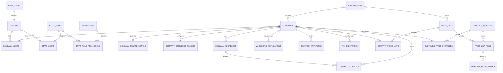
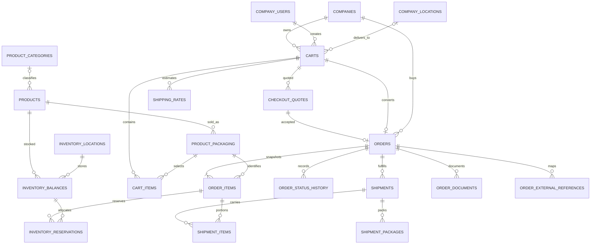
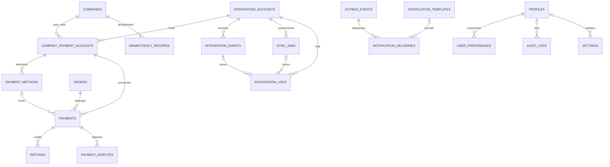

# Database ERD

Proposed target model; diagrams emphasize transactional relationships. All entities have UUID primary keys and creation/update timestamps. The full column and constraint definition is in [schema.sql](schema.sql). Tables are introduced incrementally, not all at once in Phase 1.

## Identity, companies and pricing

## Catalog, ordering and fulfillment

Order items must belong to the shipment's order; composite foreign keys enforce this. Order/cart/quote membership and location foreign keys include company ID. An order's commercial snapshot survives product edits; products are archived rather than deleted.

## Payments and asynchronous processing

`shipping_rules` and versioned `settings` govern calculations through snapshotted configurations. `outbox_events.aggregate_id` and `audit_logs.entity_id` are intentionally polymorphic identifiers; domain handlers validate them. They are not relational foreign keys. Provider event IDs are deduplicated per integration account, including its test/live mode.
